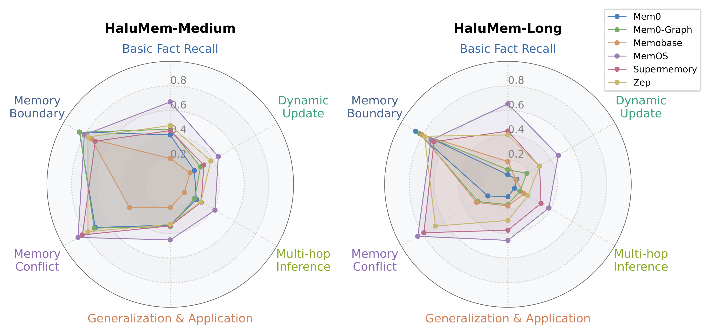

<h1 align="center">
    HaluMem: A Comprehensive Benchmark for Evaluating Hallucinations in Memory Systems
</h1>
<p align="center">
<a href="https://spdx.org/licenses/CC-BY-NC-ND-4.0.html">
    
</a>
<a href="https://github.com/MemTensor/HaluMem/issues">
    
</a>
<a href="https://arxiv.org/abs/2511.03506">
     
</a>
<a href="https://huggingface.co/datasets/IAAR-Shanghai/HaluMem">
    
</a>
</p>

## 📊 Why We Define the HaluMem Evaluation Tasks

<div align="center">
    <table border="0">
        <tr>
            <td width="45%" align="center">
                
                <br>
                <em><strong>Fig 1.</strong> HaluMem vs Existing Benchmarks for Memory Systems. </em>
            </td>
        </tr>
    </table>
</div>

- **Limitations of Existing Frameworks**
   Most existing evaluation frameworks treat memory systems as **black-box models**, assessing performance only through **end-to-end QA accuracy**.
   However, this approach has **two major limitations**:
  1. It lacks a **hallucination evaluation** specifically designed for the characteristics of memory systems.
  2. It fails to examine the **core operational steps** in how memory is processed, such as retrieval and updating.
- **Motivation for HaluMem**
   To address these issues, we introduce **HaluMem**, a comprehensive benchmark that defines fine-grained evaluation tasks tailored for memory systems.

------

## 🧩 What Is HaluMem?

The paper *“HaluMem: A Comprehensive Benchmark for Evaluating Hallucinations in Memory Systems”* presents the **first operation-level hallucination benchmark** designed explicitly for memory systems.

HaluMem decomposes the memory workflow into **three fundamental operations**:

- **🧩 Memory Extraction**
   Evaluates whether the system can **accurately identify and store factual information** from dialogue sessions while avoiding **hallucinated or irrelevant memories**.
   This task measures both **memory completeness** (how well the reference memory points are captured) and **memory accuracy** (how precisely the extracted memories reflect the ground truth).
- **🔄 Memory Update**
   Evaluates whether the system can **correctly modify or overwrite existing memories** when new dialogue provides updated or contradictory information, ensuring internal **consistency and temporal coherence** within the memory base.
- **💬 Memory Question Answering**
   Evaluates the system’s **end-to-end capability** to integrate multiple memory processes  (including **extraction**, **update**, **retrieval**, and **response generation**) to produce factual, context-aware, and hallucination-free answers.

Each operation includes carefully designed evaluation tasks to **reveal hallucination behaviors** at different stages of memory handling.

------

## 🏆 LeaderBoard

We conducted a comprehensive evaluation of several state-of-the-art memory systems on HaluMem, including [Mem0](https://github.com/mem0ai/mem0) (both standard and graph versions), [Memobase](https://github.com/memodb-io/memobase), [MemOS](https://github.com/MemTensor/MemOS), [Supermemory](https://github.com/supermemoryai/supermemory), and [Zep](https://github.com/getzep/zep). For a comprehensive understanding of the methodology and metric calculations, please refer to our [paper](https://arxiv.org/abs/2511.03506).

---

<details open>
<summary><h3>🥇 1. Main Evaluation Results</h3></summary>

The main evaluation assesses memory systems across **three core tasks**:

1.  **Memory Extraction**: Evaluates **Memory Integrity** (Recall of reference memory points) and **Memory Accuracy** (Precision of extracted memory points).
2.  **Memory Updating**: Evaluates accuracy, hallucination, and omission rates during memory updates.
3.  **Question Answering**: Evaluates accuracy, hallucination, and omission rates in downstream QA tasks.

<div align="center">
    <table border="0">
        <tr>
            <td width="45%" align="center">
                
                <br>
                <em><strong>Fig 2.</strong> Hallucination Evaluation Process. </em>
            </td>
        </tr>
    </table>
</div>

> **📝 Metric Legend:**
> *   **R**: Recall (Higher is better ↑)
> *   **Target P**: Target Memory Precision (Higher is better ↑)
> *   **Acc.**: Memory Accuracy (Higher is better ↑)
> *   **FMR**: False Memory Resistance (Higher is better ↑)
> *   **F1**: Memory Extraction F1-score (Higher is better ↑)
> *   **C**: Correct Rate / Accuracy (Higher is better ↑)
> *   **H**: Hallucination Rate (Lower is better ↓)
> *   **O**: Omission Rate (Lower is better ↓)
> *   *(Values in parentheses in "Target P" and "Acc." columns represent the count of extracted memories)*

*The tables are sorted based on a holistic performance assessment, prioritizing **F1-score**, **QA Accuracy**, and **Updating Accuracy**.*

#### 🔹 HaluMem-Medium Dataset
<table>
    <thead>
        <tr>
            <!-- <th rowspan="2">Dataset</th> -->
            <th rowspan="2" align="center">System</th>
            <th colspan="6" align="center">Memory Extraction</th>
            <th colspan="3" align="center">Memory Updating</th>
            <th colspan="3" align="center">Question Answering</th>
        </tr>
        <tr>
            <th align="center">R↑</th>
            <th align="center">Weighted&nbsp;R↑</th>
            <th align="center">Target&nbsp;P↑</th>
            <th align="center">Acc.↑</th>
            <th align="center">FMR↑</th>
            <th align="center">F1↑</th>
            <th align="center">C↑</th>
            <th align="center">H↓</th>
            <th align="center">O↓</th>
            <th align="center">C↑</th>
            <th align="center">H↓</th>
            <th align="center">O↓</th>
        </tr>
    </thead>
    <tbody>
        <!-- Medium Dataset -->
        <tr>
            <td align="center">MemOS</td>
            <td align="center"><strong>74.07%</strong></td>
            <td align="center"><strong>84.81%</strong></td>
            <td align="center">86.25%(45190)</td>
            <td align="center">59.55%(71793)</td>
            <td align="center">44.94%</td>
            <td align="center"><strong>79.70%</strong></td>
            <td align="center"><strong>62.11%</strong></td>
            <td align="center">0.42%</td>
            <td align="center"><strong>37.48%</strong></td>
            <td align="center"><strong>67.23%</strong></td>
            <td align="center"><strong>15.17%</strong></td>
            <td align="center"><strong>17.59%</strong></td>
        </tr>
        <tr>
            <td align="center">Zep</td>
            <td align="center">-</td>
            <td align="center">-</td>
            <td align="center">-</td>
            <td align="center">-</td>
            <td align="center">-</td>
            <td align="center">-</td>
            <td align="center">47.28%</td>
            <td align="center">0.42%</td>
            <td align="center">52.31%</td>
            <td align="center">55.47%</td>
            <td align="center">21.92%</td>
            <td align="center">22.62%</td>
        </tr>
        <tr>
            <td align="center">Mem0-Graph</td>
            <td align="center">43.28%</td>
            <td align="center">65.52%</td>
            <td align="center">87.20%(10567)</td>
            <td align="center"><strong>61.86%(16230)</strong></td>
            <td align="center">55.70%</td>
            <td align="center">57.85%</td>
            <td align="center">24.50%</td>
            <td align="center"><strong>0.26%</strong></td>
            <td align="center">75.24%</td>
            <td align="center">54.66%</td>
            <td align="center">19.28%</td>
            <td align="center">26.06%</td>
        </tr>
        <tr>
            <td align="center">Mem0</td>
            <td align="center">42.91%</td>
            <td align="center">65.03%</td>
            <td align="center">86.26%(10556)</td>
            <td align="center">60.86%(16291)</td>
            <td align="center">56.80%</td>
            <td align="center">57.31%</td>
            <td align="center">25.50%</td>
            <td align="center">0.45%</td>
            <td align="center">74.02%</td>
            <td align="center">53.02%</td>
            <td align="center">19.17%</td>
            <td align="center">27.81%</td>
        </tr>
        <tr>
            <td align="center">Supermemory</td>
            <td align="center">41.53%</td>
            <td align="center">64.76%</td>
            <td align="center">90.32%(14134)</td>
            <td align="center">60.83%(22551)</td>
            <td align="center">51.77%</td>
            <td align="center">56.90%</td>
            <td align="center">16.37%</td>
            <td align="center">1.15%</td>
            <td align="center">82.47%</td>
            <td align="center">54.07%</td>
            <td align="center">22.24%</td>
            <td align="center">23.69%</td>
        </tr>
        <tr>
            <td align="center">Memobase</td>
            <td align="center">14.55%</td>
            <td align="center">25.88%</td>
            <td align="center"><strong>92.24%(5443)</strong></td>
            <td align="center">32.29%(17081)</td>
            <td align="center"><strong>80.78%</strong></td>
            <td align="center">25.13%</td>
            <td align="center">5.20%</td>
            <td align="center">0.55%</td>
            <td align="center">94.25%</td>
            <td align="center">35.33%</td>
            <td align="center">29.97%</td>
            <td align="center">34.71%</td>
        </tr>
    </tbody>
</table>

#### 🔸 HaluMem-Long Dataset
<table>
    <thead>
        <tr>
            <!-- <th rowspan="2">Dataset</th> -->
            <th rowspan="2" align="center">System</th>
            <th colspan="6" align="center">Memory Extraction</th>
            <th colspan="3" align="center">Memory Updating</th>
            <th colspan="3" align="center">Question Answering</th>
        </tr>
        <tr>
            <th align="center">R↑</th>
            <th align="center">Weighted&nbsp;R↑</th>
            <th align="center">Target&nbsp;P↑</th>
            <th align="center">Acc.↑</th>
            <th align="center">FMR↑</th>
            <th align="center">F1↑</th>
            <th align="center">C↑</th>
            <th align="center">H↓</th>
            <th align="center">O↓</th>
            <th align="center">C↑</th>
            <th align="center">H↓</th>
            <th align="center">O↓</th>
        </tr>
    </thead>
    <tbody>
        <tr>
            <td align="center">MemOS</td>
            <td align="center"><strong>81.90%</strong></td>
            <td align="center"><strong>89.56%</strong></td>
            <td align="center">82.32%(48246)</td>
            <td align="center">43.77%(99462)</td>
            <td align="center">28.85%</td>
            <td align="center"><strong>82.11%</strong></td>
            <td align="center"><strong>65.25%</strong></td>
            <td align="center">0.29%</td>
            <td align="center"><strong>34.47%</strong></td>
            <td align="center"><strong>64.44%</strong></td>
            <td align="center"><strong>16.61%</strong></td>
            <td align="center"><strong>18.95%</strong></td>
        </tr>
        <tr>
            <td align="center">Supermemory</td>
            <td align="center">53.02%</td>
            <td align="center">70.73%</td>
            <td align="center">85.82%(24483)</td>
            <td align="center">29.71%(77134)</td>
            <td align="center">36.86%</td>
            <td align="center">65.54%</td>
            <td align="center">17.01%</td>
            <td align="center">0.58%</td>
            <td align="center">82.42%</td>
            <td align="center">53.77%</td>
            <td align="center">22.21%</td>
            <td align="center">24.02%</td>
        </tr>
        <tr>
            <td align="center">Zep</td>
            <td align="center">-</td>
            <td align="center">-</td>
            <td align="center">-</td>
            <td align="center">-</td>
            <td align="center">-</td>
            <td align="center">-</td>
            <td align="center">37.35%</td>
            <td align="center">0.48%</td>
            <td align="center">62.14%</td>
            <td align="center">50.19%</td>
            <td align="center">22.51%</td>
            <td align="center">27.30%</td>
        </tr>
        <tr>
            <td align="center">Memobase</td>
            <td align="center">6.18%</td>
            <td align="center">14.68%</td>
            <td align="center"><strong>88.56%(3077)</strong></td>
            <td align="center">25.61%(11795)</td>
            <td align="center">85.39%</td>
            <td align="center">11.55%</td>
            <td align="center">4.10%</td>
            <td align="center">0.36%</td>
            <td align="center">95.38%</td>
            <td align="center">33.60%</td>
            <td align="center">29.46%</td>
            <td align="center">36.96%</td>
        </tr>
        <tr>
            <td align="center">Mem0-Graph</td>
            <td align="center">2.24%</td>
            <td align="center">10.76%</td>
            <td align="center">87.32%(785)</td>
            <td align="center">41.26%(1866)</td>
            <td align="center"><strong>88.36%</strong></td>
            <td align="center">4.36%</td>
            <td align="center">1.47%</td>
            <td align="center">0.04%</td>
            <td align="center">98.40%</td>
            <td align="center">32.44%</td>
            <td align="center">21.82%</td>
            <td align="center">45.74%</td>
        </tr>
        <tr>
            <td align="center">Mem0</td>
            <td align="center">3.23%</td>
            <td align="center">11.89%</td>
            <td align="center">88.01%(1134)</td>
            <td align="center"><strong>46.01%(2433)</strong></td>
            <td align="center">87.65%</td>
            <td align="center">6.22%</td>
            <td align="center">1.45%</td>
            <td align="center"><strong>0.03%</strong></td>
            <td align="center">98.51%</td>
            <td align="center">28.11%</td>
            <td align="center">17.29%</td>
            <td align="center">54.60%</td>
        </tr>
    </tbody>
</table>

> **⚠️ Note on Zep:** Since Zep does not provide a *Get Dialogue Memory API*, metrics related to memory extraction cannot be computed.

</details>

<details>
<summary><h3>🎯 2. Typewise Accuracy: Event, Persona, and Relationship</h3></summary>

This section reports the **extraction accuracy** of each memory system across three specific memory categories: **Event**, **Persona**, and **Relationship**. 

The statistics include all memory points derived from both the *Memory Extraction* and *Memory Updating* tasks, excluding distractor memories.

#### 🔹 HaluMem-Medium Dataset
<table>
    <thead>
        <tr>
            <th align="center">System</th>
            <th align="center">Event</th>
            <th align="center">Persona</th>
            <th align="center">Relationship</th>
        </tr>
    </thead>
    <tbody>
        <tr>
            <td align="center">MemOS</td>
            <td align="center"><strong>63.41%</strong></td>
            <td align="center"><strong>59.77%</strong></td>
            <td align="center"><strong>62.40%</strong></td>
        </tr>
        <tr>
            <td align="center">Zep</td>
            <td align="center"><u>44.83%*</u></td>
            <td align="center"><u>49.75%*</u></td>
            <td align="center"><u>38.81%*</u></td>
        </tr>
        <tr>
            <td align="center">Mem0</td>
            <td align="center">29.69%</td>
            <td align="center">33.74%</td>
            <td align="center">27.77%</td>
        </tr>
        <tr>
            <td align="center">Mem0-Graph</td>
            <td align="center">30.02%</td>
            <td align="center">33.71%</td>
            <td align="center">26.60%</td>
        </tr>
        <tr>
            <td align="center">Supermemory</td>
            <td align="center">28.66%</td>
            <td align="center">32.11%</td>
            <td align="center">20.67%</td>
        </tr>
        <tr>
            <td align="center">Memobase</td>
            <td align="center">5.12%</td>
            <td align="center">13.38%</td>
            <td align="center">6.79%</td>
        </tr>
    </tbody>
</table>


#### 🔸 HaluMem-Long Dataset
<table>
    <thead>
        <tr>
            <th align="center">System</th>
            <th align="center">Event</th>
            <th align="center">Persona</th>
            <th align="center">Relationship</th>
        </tr>
    </thead>
    <tbody>
        <tr>
            <td align="center">MemOS</td>
            <td align="center"><strong>70.92%</strong></td>
            <td align="center"><strong>68.35%</strong></td>
            <td align="center"><strong>71.68%</strong></td>
        </tr>
        <tr>
            <td align="center">Supermemory</td>
            <td align="center"><u>38.48%</u></td>
            <td align="center"><u>40.85%</u></td>
            <td align="center"><u>32.61%</u></td>
        </tr>
        <tr>
            <td align="center">Zep</td>
            <td align="center">35.76%*</td>
            <td align="center">39.07%*</td>
            <td align="center">31.16%*</td>
        </tr>
        <tr>
            <td align="center">Memobase</td>
            <td align="center">4.09%</td>
            <td align="center">5.32%</td>
            <td align="center">4.21%</td>
        </tr>
        <tr>
            <td align="center">Mem0</td>
            <td align="center">0.92%</td>
            <td align="center">3.01%</td>
            <td align="center">2.18%</td>
        </tr>
        <tr>
            <td align="center">Mem0-Graph</td>
            <td align="center">1.10%</td>
            <td align="center">2.00%</td>
            <td align="center">1.59%</td>
        </tr>
    </tbody>
</table>


> **⚠️ Note:** The memory entries for **Zep** include only those derived from the *Memory Updating* task.

</details>

<details>
<summary><h3>❓ 3. Performance Across Question Types</h3></summary>

Evaluation of memory system performance across different types of questions.

<div align="center">
    <table border="0">
        <tr>
            <td width="45%" align="center">
                <!-- 替换下面的 src 为你的 Medium 雷达图路径 -->
                
                <br>
                <em><strong>Fig 3.</strong> Radar Chart </em>
            </td>
        </tr>
    </table>
</div>


#### 🔹 HaluMem-Medium Dataset
<table>
    <thead>
        <tr>
            <th align="center">System</th>
            <th align="center">Basic Fact<br>Recall</th>
            <th align="center">Dynamic<br>Update</th>
            <th align="center">Multi-hop<br>Inference</th>
            <th align="center">Generalization<br>& Application</th>
            <th align="center">Memory<br>Conflict</th>
            <th align="center">Memory<br>Boundary</th>
        </tr>
    </thead>
    <tbody>
        <tr>
            <td align="center">MemOS</td>
            <td align="center"><strong>67.02%</strong></td>
            <td align="center"><strong>45.00%</strong></td>
            <td align="center"><strong>41.92%</strong></td>
            <td align="center"><strong>45.17%</strong></td>
            <td align="center"><strong>86.35%</strong></td>
            <td align="center">80.43%</td>
        </tr>
        <tr>
            <td align="center">Zep</td>
            <td align="center"><u>47.81%</u></td>
            <td align="center"><u>38.05%</u></td>
            <td align="center">28.68%</td>
            <td align="center">32.50%</td>
            <td align="center">77.05%</td>
            <td align="center">77.05%</td>
        </tr>
        <tr>
            <td align="center">Supermemory</td>
            <td align="center">43.68%</td>
            <td align="center">31.42%</td>
            <td align="center"><u>29.07%</u></td>
            <td align="center">33.75%</td>
            <td align="center"><u>82.26%</u></td>
            <td align="center">70.17%</td>
        </tr>
        <tr>
            <td align="center">Mem0-Graph</td>
            <td align="center">44.81%</td>
            <td align="center">28.32%</td>
            <td align="center">22.87%</td>
            <td align="center"><u>34.38%</u></td>
            <td align="center">71.22%</td>
            <td align="center"><u>84.66%</u></td>
        </tr>
        <tr>
            <td align="center">Mem0</td>
            <td align="center">40.18%</td>
            <td align="center">22.57%</td>
            <td align="center">24.42%</td>
            <td align="center">33.12%</td>
            <td align="center">70.22%</td>
            <td align="center"><strong>85.02%</strong></td>
        </tr>
        <tr>
            <td align="center">Memobase</td>
            <td align="center">21.03%</td>
            <td align="center">18.58%</td>
            <td align="center">13.18%</td>
            <td align="center">18.82%</td>
            <td align="center">38.09%</td>
            <td align="center">73.79%</td>
        </tr>
    </tbody>
</table>

#### 🔸HaluMem- Long Dataset
<table>
    <thead>
        <tr>
            <th align="center">System</th>
            <th align="center">Basic Fact<br>Recall</th>
            <th align="center">Dynamic<br>Update</th>
            <th align="center">Multi-hop<br>Inference</th>
            <th align="center">Generalization<br>& Application</th>
            <th align="center">Memory<br>Conflict</th>
            <th align="center">Memory<br>Boundary</th>
        </tr>
    </thead>
    <tbody>
        <tr>
            <td align="center">MemOS</td>
            <td align="center"><strong>65.42%</strong></td>
            <td align="center"><strong>47.22%</strong></td>
            <td align="center"><strong>38.38%</strong></td>
            <td align="center"><strong>45.58%</strong></td>
            <td align="center"><strong>84.40%</strong></td>
            <td align="center">71.98%</td>
        </tr>
        <tr>
            <td align="center">Supermemory</td>
            <td align="center"><u>43.30%</u></td>
            <td align="center"><u>29.65%</u></td>
            <td align="center"><u>31.01%</u></td>
            <td align="center"><u>37.26%</u></td>
            <td align="center"><u>78.66%</u></td>
            <td align="center">69.20%</td>
        </tr>
        <tr>
            <td align="center">Zep</td>
            <td align="center">40.18%</td>
            <td align="center"><u>29.65%</u></td>
            <td align="center">18.60%</td>
            <td align="center">29.36%</td>
            <td align="center">67.87%</td>
            <td align="center">78.14%</td>
        </tr>
        <tr>
            <td align="center">Memobase</td>
            <td align="center">18.52%</td>
            <td align="center">7.52%</td>
            <td align="center">15.12%</td>
            <td align="center">17.57%</td>
            <td align="center">29.40%</td>
            <td align="center">80.56%</td>
        </tr>
        <tr>
            <td align="center">Mem0-Graph</td>
            <td align="center">11.89%</td>
            <td align="center">17.78%</td>
            <td align="center">11.11%</td>
            <td align="center">16.48%</td>
            <td align="center">28.01%</td>
            <td align="center"><u>82.50%</u></td>
        </tr>
        <tr>
            <td align="center">Mem0</td>
            <td align="center">7.76%</td>
            <td align="center">8.41%</td>
            <td align="center">6.20%</td>
            <td align="center">10.04%</td>
            <td align="center">18.86%</td>
            <td align="center"><strong>86.35%</strong></td>
        </tr>
    </tbody>
</table>

</details>

<details>
<summary><h3>⏱️ 4. Time Consumption & Latency</h3></summary>

This section reports the time consumption of all memory systems during the evaluation process for **dialogue addition** and **memory retrieval**, as well as their **total runtime**.

#### 🔹 HaluMem-Medium Dataset

<table>
    <thead>
        <tr>
            <th align="center">System</th>
            <th align="center">Dialogue Addition<br>Time (min)</th>
            <th align="center">Memory Retrieval<br>Time (min)</th>
            <th align="center">Total<br>Time (min)</th>
        </tr>
    </thead>
    <tbody>
        <tr>
            <td align="center">Supermemory</td>
            <td align="center"><strong>273.21</strong></td>
            <td align="center">95.53</td>
            <td align="center"><strong>368.74</strong></td>
        </tr>
        <tr>
            <td align="center">Memobase</td>
            <td align="center"><u>293.30</u></td>
            <td align="center">139.95</td>
            <td align="center"><u>433.25</u></td>
        </tr>
        <tr>
            <td align="center">MemOS</td>
            <td align="center">1028.84</td>
            <td align="center"><strong>20.52</strong></td>
            <td align="center">1049.37</td>
        </tr>
        <tr>
            <td align="center">Mem0</td>
            <td align="center">2768.14</td>
            <td align="center"><u>41.66</u></td>
            <td align="center">2809.80</td>
        </tr>
        <tr>
            <td align="center">Mem0-Graph</td>
            <td align="center">2840.07</td>
            <td align="center">54.65</td>
            <td align="center">2894.72</td>
        </tr>   
        <tr>
            <td align="center">Zep</td>
            <td align="center">-</td>
            <td align="center">53.34</td>
            <td align="center">-</td>
        </tr>
    </tbody>
</table>

#### 🔸HaluMem- Long Dataset

<table>
    <thead>
        <tr>
            <th align="center">System</th>
            <th align="center">Dialogue Addition<br>Time (min)</th>
            <th align="center">Memory Retrieval<br>Time (min)</th>
            <th align="center">Total<br>Time (min)</th>
        </tr>
    </thead>
    <tbody>
        <tr>
            <td align="center">Memobase</td>
            <td align="center"><strong>239.29</strong></td>
            <td align="center">136.19</td>
            <td align="center"><strong>375.48</strong></td>
        </tr>
        <tr>
            <td align="center">Mem0</td>
            <td align="center"><u>691.62</u></td>
            <td align="center"><u>39.15</u></td>
            <td align="center"><u>730.77</u></td>
        </tr>
        <tr>
            <td align="center">Mem0-Graph</td>
            <td align="center">870.32</td>
            <td align="center">62.42</td>
            <td align="center">932.74</td>
        </tr>
        <tr>
            <td align="center">MemOS</td>
            <td align="center">1524.39</td>
            <td align="center"><strong>20.96</strong></td>
            <td align="center">1545.34</td>
        </tr>
        <tr>
            <td align="center">Supermemory</td>
            <td align="center">1672.53</td>
            <td align="center">137.02</td>
            <td align="center">1809.55</td>
        </tr>
        <tr>
            <td align="center">Zep</td>
            <td align="center">-</td>
            <td align="center">50.22</td>
            <td align="center">-</td>
        </tr>
    </tbody>
</table>

> **⚠️ Note on Zep:**  latency results for dialogue addition are unavailable because Zep lacks a synchronous *Add Dialogue API*, preventing the accurate measurement of processing time via its asynchronous interface.

</details>

------

## 💻 Usage & Resources

### ⚙️ Evaluation Code

The **HaluMem** benchmark includes a complete evaluation suite located in the [`eval/`](./eval) directory.
It supports **multiple memory systems** and provides standardized pipelines for testing hallucination resistance and memory performance.

#### 🚀 Quick Start

1. **Navigate to the evaluation directory**

   ```bash
   cd eval
   ```

2. **Install dependencies**

   ```bash
   poetry install --with eval
   ```

3. **Configure environment variables**
   Copy `.env-example` to `.env`, then fill in the required API keys and runtime parameters.

   ```bash
   cp .env-example .env
   ```

4. **Run evaluation (example: Mem0 system)**

   ```bash
   # Step 1: Extract memories and perform QA retrieval
   python eval_memzero.py

   # Step 2: Evaluate memory extraction, update, and QA tasks
   python evaluation.py --frame memzero --version default
   ```

   * For the **Graph** version of Mem0, use `eval_memzero_graph.py`.
   * For **MemOS**, use `eval_memos.py`.
   * Other supported systems follow the same naming pattern.

5. **View results**
   All evaluation outputs (task scores, FMR, aggregated metrics) are saved in the `results/` directory.

For full command details, configuration options, and examples, see [`eval/README.md`](./eval/README.md).

---

### 📦 Dataset Access

The complete **HaluMem dataset** is publicly available on **Hugging Face**:
🔗 [https://huggingface.co/datasets/IAAR-Shanghai/HaluMem](https://huggingface.co/datasets/IAAR-Shanghai/HaluMem)

Available versions:

* `Halu-Medium` — multi-turn dialogues with moderate context (~160k tokens per user)
* `Halu-Long` — extended 1M-token context with distractor interference

-----

> [!TIP]
>
> 🧩 **Recommended Workflow**
>
> 1. Download the dataset from Hugging Face.
> 2. Configure evaluation parameters in `eval/.env`.
> 3. Run evaluation scripts to compute metrics for your memory system.
> 4. Check results in the `results/` folder and compare across models.
>
> For reproducibility and further setup, refer to [`eval/README.md`](./eval/README.md).

-----

## 📚 Dataset Overview

HaluMem consists of two dataset versions:

| Dataset         | #Users | #Dialogues | Avg. Sessions/User | Avg. Context Length | #Memory Points | #QA Pairs |
| --------------- | ------ | ---------- | ------------------ | ------------------- | -------------- | --------- |
| **Halu-Medium** | 20     | 30,073     | 70                 | ~160k tokens        | 14,948         | 3,467     |
| **Halu-Long**   | 20     | 53,516     | 120                | ~1M tokens          | 14,948         | 3,467     |

- **Halu-Medium** provides multi-turn human-AI dialogue sessions for evaluating memory hallucinations in standard-length contexts.
- **Halu-Long** extends context length to **1M tokens** per user, introducing large-scale **interference and distractor content** (e.g., factual QA and math problems) to assess robustness and hallucination resistance.

------

## 🧱 Dataset Structure

Each user’s data is stored as a **JSON object** containing:

| Field          | Description                                                  |
| -------------- | ------------------------------------------------------------ |
| `uuid`         | Unique user identifier                                       |
| `persona_info` | Persona profile including background, traits, goals, and motivations |
| `sessions`     | List of multi-turn conversational sessions                   |

Each `session` includes:

| Field                    | Description                                           |
| ------------------------ | ----------------------------------------------------- |
| `start_time`, `end_time` | Session timestamps                                    |
| `dialogue_turn_num`      | Total turns in the dialogue                           |
| `dialogue`               | Sequence of utterances between `user` and `assistant` |
| `memory_points`          | List of extracted memory elements from the session    |
| `questions`              | QA pairs used for memory reasoning and evaluation     |
| `dialogue_token_length`  | Tokenized length of the full dialogue                 |

#### Memory Point Structure

Each memory point captures a **specific fact or event** derived from dialogue.

| Field               | Description                                                  |
| ------------------- | ------------------------------------------------------------ |
| `index`             | Memory ID within the session                                 |
| `memory_content`    | Text description of the memory                               |
| `memory_type`       | Type (e.g., *Persona Memory*, *Event Memory*, *Relationship Memory*) |
| `memory_source`     | Origin: `primary`, `secondary`, `interference`, or `system`  |
| `is_update`         | Indicates if it modifies an existing memory                  |
| `original_memories` | Previous related memories (if updated)                       |
| `importance`        | Relative salience score (0–1)                                |
| `timestamp`         | Time of creation or update                                   |

#### Memory Point Example

```json
{
    "index": 1,
    "memory_content": "Martin Mark is considering a career change due to the impact of his current role on his mental health.",
    "memory_type": "Event Memory",
    "memory_source": "secondary",
    "is_update": "True",
    "original_memories": [
        "Martin Mark is considering a career change due to health impacts from his current role."
    ],
    "timestamp": "Dec 15, 2025, 08:41:23",
    "importance": 0.75
}
```

#### Dialogue Structure

Each dialogue turn includes:

```json
[
    {
        "role": "user",
        "content": "I've been reflecting a lot on my career lately, especially how my current role as a director at Huaxin Consulting is impacting my mental health. It's becoming increasingly clear that I need to make a change.",
        "timestamp": "Dec 15, 2025, 06:11:23",
        "dialogue_turn": 0
    },
    {
        "role": "assistant",
        "content": "It's great that you're taking the time to reflect on your career, Martin. Recognizing the impact on your mental health is a crucial step. Balancing professional responsibilities with health is essential, especially given your commitment to improving healthcare access globally. Have you considered how a career change might not only address your health concerns but also align with your humanitarian goals and personal well-being?",
        "timestamp": "Dec 15, 2025, 06:11:23",
        "dialogue_turn": 0
    }
]
```

#### Question–Answer Structure

Each question tests **memory retrieval**, **reasoning**, or **hallucination control**:

```json
{
  "question": "What type of new physical activity might Martin be interested in trying after April 10, 2026?",
  "answer": "Other extreme sports.",
  "evidence": [
    {
      "memory_content": "Martin has developed a newfound appreciation for extreme sports...",
      "memory_type": "Persona Memory"
    }
  ],
  "difficulty": "medium",
  "question_type": "Generalization & Application"
}
```

------

## 🧬 Dataset Construction Process

The **HaluMem dataset** was built through a **six-stage, carefully controlled pipeline** that combines **programmatic generation**, **LLM-assisted refinement**, and **human validation** to ensure realism, consistency, and reliability.

<div align="center">
    <table border="0">
        <tr>
            <td width="45%" align="center">
                
                <br>
                <em><strong>Fig 4.</strong> Framework of the HaluMem Construction Pipeline. </em>
            </td>
        </tr>
    </table>
</div>

1. **🧑‍💼 Stage 1: Persona Construction**
    Each dataset user begins with a richly detailed **virtual persona** consisting of three layers — *core profile information* (e.g., demographics, education, goals), *dynamic state information* (e.g., occupation, health, relationships), and *preference information* (e.g., food, music, hobbies).
    Personas were initially generated via rule-based templates seeded from **Persona Hub (1B+ personas)** and then refined using **GPT-4o**, ensuring logical coherence and natural diversity.
2. **📈 Stage 2: Life Skeleton Planning**
    A structured **life skeleton** defines each user’s evolving timeline, linking major career milestones and life events to the progression of dynamic and preference states.
    Controlled probabilistic mechanisms ensure realistic variation and coherent event evolution, forming a narrative blueprint for downstream data generation.
3. **📜 Stage 3: Event Flow Generation**
    The abstract life skeleton is converted into a **chronological event flow**, including:
   - **Init Events** — derived from initial persona profiles
   - **Career Events** — multi-stage professional or health-related developments
   - **Daily Events** — lifestyle or preference changes
      Together, these events form each user’s **memory timeline**, providing a consistent and interpretable narrative structure.
4. **🧠 Stage 4: Session Summaries & Memory Points**
    Each event is transformed into a **session summary** simulating a human–AI interaction. From these summaries, **structured memory points** are extracted, categorized into *Persona*, *Event*, and *Relationship* memories.
    Update-type memories maintain traceability by linking to their replaced versions, ensuring temporal consistency.
5. **💬 Stage 5: Multi-turn Session Generation**
    The summaries are expanded into **full dialogues** containing **adversarial distractor memories** — subtly incorrect facts introduced by the AI to simulate hallucination challenges.
    Additional irrelevant QAs are inserted to increase contextual complexity without altering original memories, mimicking real-world long-context noise.
6. **❓ Stage 6: Question Generation**
    Based on the sessions and memory points, **six types of evaluation questions** are automatically generated, covering both factual recall and reasoning tasks.
    Each question includes difficulty level, reasoning type, and direct evidence links to the supporting memory points.
7. **🧾 Human Annotation & Quality Verification**
    A team of 8 annotators manually reviewed over **50% of Halu-Medium**, scoring each session’s memory points and QA pairs on **correctness**, **relevance**, and **consistency**.
    Results demonstrate high data quality:
   - ✅ **Accuracy:** 95.70%
   - 📎 **Relevance:** 9.58 / 10
   - 🔁 **Consistency:** 9.45 / 10

------

> [!NOTE]
>
> 🧩 **In Summary:**
>  HaluMem provides a **comprehensive and standardized benchmark** for investigating hallucinations in memory systems.
>  By covering **core memory operations**, scaling **context length**, and introducing **distractor interference**, it establishes a robust foundation for **systematic hallucination research** in large language model memory architectures.

------

## Citation
```
@misc{chen2025halumemevaluatinghallucinationsmemory,
      title={HaluMem: Evaluating Hallucinations in Memory Systems of Agents}, 
      author={Ding Chen and Simin Niu and Kehang Li and Peng Liu and Xiangping Zheng and Bo Tang and Xinchi Li and Feiyu Xiong and Zhiyu Li},
      year={2025},
      eprint={2511.03506},
      archivePrefix={arXiv},
      primaryClass={cs.CL},
      url={https://arxiv.org/abs/2511.03506}, 
}
```
